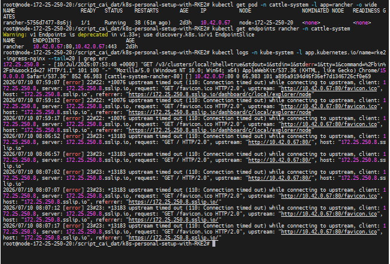

# 📓 Sự Cố Rancher Báo Lỗi 504 Gateway Timeout Sau Khi Đổi CNI

Ghi nhanh lỗi kết nối Ingress bị timeout do Pod Rancher cũ giữ cấu hình mạng của CNI cũ (Canal) sau khi nâng cấp lên CNI mới (Calico).

## 1. Triệu chứng
*   Khi truy cập trang web Rancher UI (`https://172.25.250.8.sslip.io`), trình duyệt trả về mã lỗi **`504 Gateway Time-out`**.
*   Nhật ký (Logs) của Ingress Controller (`rke2-ingress-nginx-controller`) liên tục báo lỗi timeout khi kết nối sang Pod của Rancher:
    `[error] upstream timed out (110: Connection timed out) while connecting to upstream, client: 172.25.250.8, upstream: "http://10.42.0.67:80/..."`

## 2. Bằng chứng chẩn đoán và Đối chiếu
Khi chạy các lệnh kiểm tra trạng thái IP và Endpoint, ta thu thập được dữ liệu như sau:



*   **Thời gian chạy Calico CNI**: Mới chạy được 30 phút.
*   **Thời gian chạy Pod Rancher**: Đã chạy được 2 ngày 3 giờ (`2d3h`).
*   **IP Pod Rancher**: `10.42.0.67` (đây là dải IP cũ cấp bởi Canal).
*   **Ingress logs**: Nginx cố kết nối tới `10.42.0.67:80` nhưng bị timeout.

## 3. Nguyên nhân
*   Vì CNI của cụm được thay đổi từ Canal sang Calico, các card mạng ảo cũ của Canal trên host đã bị xóa sạch để thay thế bằng Calico.
*   Tuy nhiên, do **Pod Rancher chưa được khởi động lại**, nó vẫn giữ nguyên cấu hình card mạng cũ (`veth`) kết nối với Canal. Do card mạng cũ trên Host không còn, Pod Rancher bị mất kết nối hoàn toàn với Ingress Controller chạy trên Host.
*   Bất kỳ yêu cầu nào Ingress gửi sang IP cũ của Rancher đều bị treo và báo lỗi `110: Connection timed out`.

## 4. Cách khắc phục
Khởi động lại Pod Rancher để nó tự động tạo container mới, kết nối với card mạng Calico mới và nhận IP hợp lệ mới:
```bash
# Xóa Pod để Kubernetes tự động tái tạo Pod mới
kubectl delete pod rancher-5756d7477-8s6jj -n cattle-system
```
Sau khi Pod mới lên trạng thái `1/1 Ready`, Ingress Nginx sẽ tự động nhận diện IP mới của Rancher thông qua Endpoint Service, khôi phục lại kết nối thành công.
